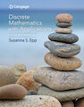

# Discrete Mathematics II
COS 280 - Discrete Mathematics II at the [University of Southern Maine](https://usm.maine.edu/cos/) offered in the [Department of Computer Science](https://usm.maine.edu/department-computer-science/).

[List of Undergraduate Computer Science Courses at USM Department of Computer Science](usm_cos.md)

## Course description

Discrete mathematics is the mathematics of computing. This course lays the foundation for students to succeed in upper-level computer science courses, most of which require understanding concepts from discrete mathematics. This course is designed for students to learn how to think logically and mathematically and practice fundamental techniques for solving problems in computer science. Topics include sequences, mathematical induction, recursion, set theory, graphs, trees, analysis of algorithms, and regular expressions. COS 280 is required for the Computer Science major (see all [requirements for Computer Science](https://catalog.usm.maine.edu/preview_program.php?catoid=13&poid=2601)).

### Prerequisites

Grade of C or higher in:

* MAT 145 - Discrete Mathematics I
* COS 160 - Structured Problem-Solving Java

## Learning Outcomes

By the end of this course, students will be able to:

* Read, comprehend, and construct mathematical proof arguments.
* Solve sequential, recursive, set, and number theoretic problems.
* Discuss graphs, trees, and finite-state machines related to real-world computational problems.
* Illustrate mathematical techniques for specifying, verifying, and analyzing computer algorithms.
* Identify various natural and relevant uses of discrete math in computer science (and the real world).

## Textbook

Epp, S. S. (2020). *Discrete Mathematics with Applications* (5th ed.). 

**Publisher**: Cengage Learning. 

**ISBN**: 978-1-337-69419-3.

## Grading

Grades will be based on a group project, in-class exercises, assignments, and participation:

* 40%: Exercises and assignments
* 20%: Quizzes
* 10%: Attendance and Participation
* 20%: Midterm Exam
* 10%: Final Exam

## Topics

* [Direct Proof]()

 
