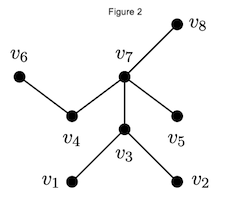

# Discrete Mathematics Lab

[University of Southern Maine Department of Computer Science](https://cs.usm.maine.edu)<br>
[COS 280 Discrete Mathematics II](https://cs.usm.maine.edu/~james.quinlan/cos280/)<br>
Instructor: [James Quinlan](https://cs.usm.maine.edu/~james.quinlan) <br>

**Lab Date**: November 15, 2023<br>


## Overview

**Trees** in computer science serve as a foundational structure, providing an essential framework for organizing and managing data efficiently. They are integral in facilitating operations like searching, sorting, indexing, and hierarchical representation, serving as the backbone for diverse algorithms and data storage paradigms in computational problem-solving.  You will revisit trees in COS285, COS360, and COS485.


## Problems

1. Use the `randadj` function to generate a random **adjacency matrix** of an undirected simple graph.  


2. Write a function that determines whether the graph is a tree.  


3. In Lab 10, we used a dictionary to represent a graph.  For example, the following code represents the graph in Figure 1.  Use a dictionary to represent the ***tree*** in Figure 2.  

	```
	G = {
    1: [2, 3],
    2: [1, 3, 4],
    3: [1, 2],
    4: [2]
	}
	```
 

4. A modification of `randadj` function was used to make `randtree(n)` function.  Generate several random trees of order $n$ using this function.  Verify it is a tree by drawing it on paper.     

5. Recall a **tree** is a connected graph with no cycles. Can you use an adjacency matrix to determine if the graph is connected and has no cycles?  Write a function `isConnected(X)` (returning a boolean) that uses the adjacency matrix to determine if a graph is connected.  Hint: This function will use `zeros`, `gt0`, `matadd`, and `matmul`.  


6. Modify the code of `randadj` to allow for multiple edges but no loops.  Assign `t = 1` for this case. 

7. A binary tree tree can be represented as an array (i.e., a list).  The parent of a given node and its left and right children can be calculated using indices. In particular, node $i$'s left and right children are at indexes $2i+1$ and $2i+2$.  The parent of index $i$ is $\lfloor \frac{i - 1}{2} \rfloor$.  Represent the following binary tree using an array.  What is the parent of 21 and the right child of 16?  How do you represent the "missing children"?


8. An equivalent **definition of a tree** is a connected graph with $n-1$ edges.  Write a function `edgeCnt(G)` that returns the number of edges in the graph  `G` using the adjacency matrix.  This should work for any graph, not just trees.  Then, use this information, the equation below, and `isConnected` to determine if a graph is a tree.
$$
2|E| = \sum_{i=1}^n \deg(v_i) .
$$ 

9. A node class can be used to represent a binary tree.   

	```
	class Node:
      def __init__(self, data):
        self.data = value
        self.left = None
        self.right = None
	```
Then, node instances of the class can be created, for example:

	```
	# Create a node with two children
    x = Node(19)
    x.left = Node(15)
    x.right = Node(25)
	```
Modify the class to include a parent property.

10. Use the Node class to build a binary search tree for the list \[19, 15, 25, 11, 16, 21, 36, 12, 17\] (see Binary tree above).    


## Matrix Functions

You will use these functions for this lab. Feel free to modify to improve as you see fit.  You can save these into one file called `matfuncs.py`, for example, then `import matfuncs`.  If you are using Google Colab, follow these steps.

1. Mount your Google drive in Google Colab

	```
	from google.colab import drive
	drive.mount('/content/drive')
	```
2. Insert the directory.  Note: Pay close attention to your path and additional directories where your Colab Notebooks are stored, i.e., `...`.

	```
	import sys
	sys.path.insert(0,'/content/drive/My Drive/Colab Notebooks/...')
	```
3. Import the file (library).

	```
	import mathfuncs
	```

#### Functions (matfuncs.py)

```
# --------------------------------------------------------------
# MATRIX FUNCTIONS
# Operations: +, *, random matrix generators
# Support Functions: 
#		zeros(m,n) to generate an all-zeros matrix (initializer)
# 		gt0(A) to determine if nonzero matrix
#
# NOTE: Using `numpy` replaces these operations
# 		 What other functions would you add?

# --------------------------------------------------------------
# A = 0 (matrix)
def zeros(m,n):
  C = [[ 0 for i in range(m)] for j in range(n)]
  return C

# --------------------------------------------------------------
# A * B
def matmul(A,B):
  m = len(A)
  n = len(A[0])
  q = len(B[0])
  C = zeros(m,q)
  for i in range(m):
    for j in range(q):
      for k in range(n):
        C[i][j] = C[i][j] + A[i][k]*B[k][j]
  return C

# --------------------------------------------------------------
# A + B
def matadd(A,B):
  m = len(A)
  n = len(A[0])
  C = zeros(m,n)
  for i in range(m):
    for j in range(n):
      C[i][j] = A[i][j] + B[i][j]
  return C

# --------------------------------------------------------------
# Bool: Nonzero Matrix
def gt0(X):
  m = len(X)
  n = len(X[0])
  for i in range(m):
    for j in range(n):
      if X[i][j] < 1:
        return False
  return True
  
# --------------------------------------------------------------
# Random adjacency matrix
def randadj(n,t=0):
  import random as rnd
  for i in range(n):
    for j in range(i):
      A[i][j] = rnd.randint(0,1)
      A[j][i] = A[i][j]
  if t == 0:
    for i in range(n):
      A[i][i] = 0 
  return A
  
# --------------------------------------------------------------
# Random Tree
def randtree(n):
  import random
  e = n - 1
  T = zeros(n,n)
  while not(isTree(T)):
    T = zeros(n,n)
    R = random.sample(range(n*n), e)
    for i in R:
      r = i // n
      c = i % n
      T[r][c] = 1
      T[c][r] = 1
  return T

```

<!-- 
+++++++++++++++++++++++++++++++++++++++++++++++++++++++++++++++++++++++++ 
 FOOTER 
+++++++++++++++++++++++++++++++++++++++++++++++++++++++++++++++++++++++++
-->
<div style="border-top: 1px solid #ccc;padding:0px 0px 20px 0px;"></div>
<i style="padding-left:0px;">
Last modified  Sat Nov 11 2023 04:04:43 PM EST
<a href="https://cs.usm.maine.edu/~james.quinlan/">Quinlan</a>
</i>  
